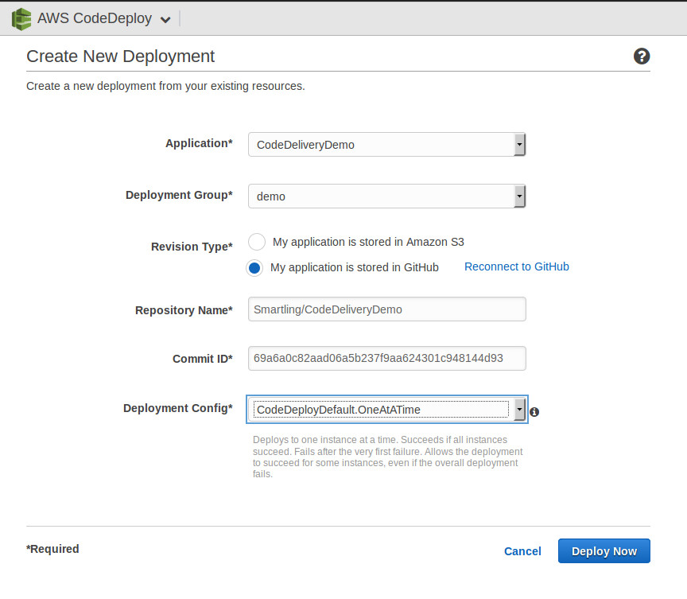
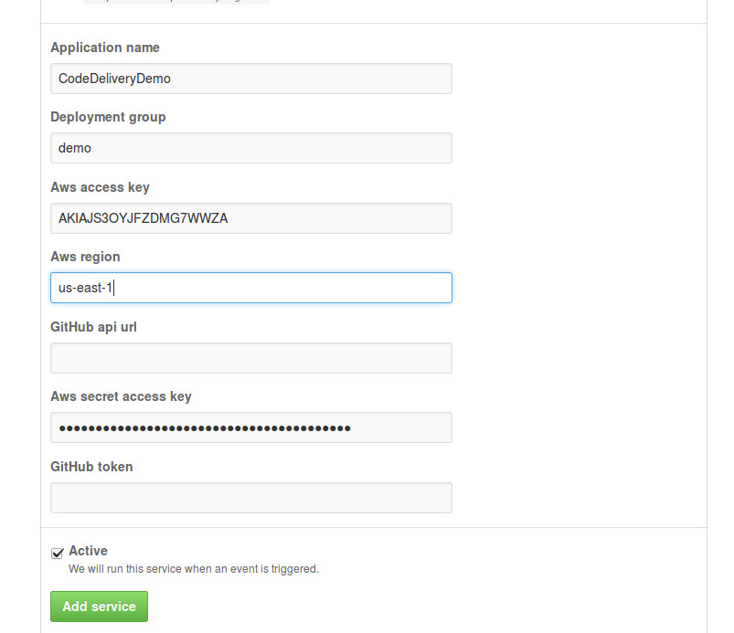
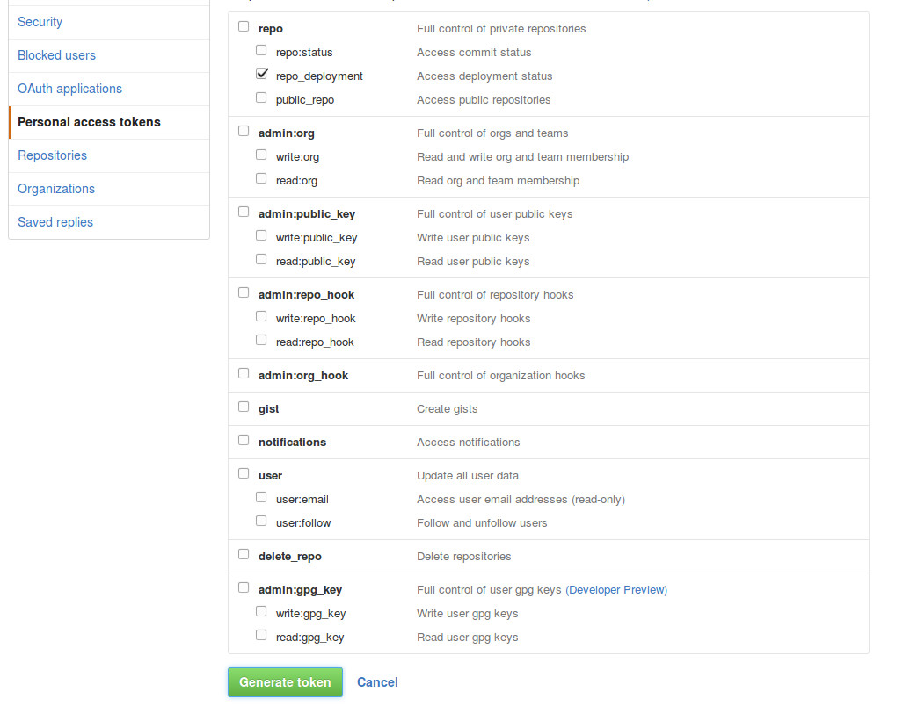
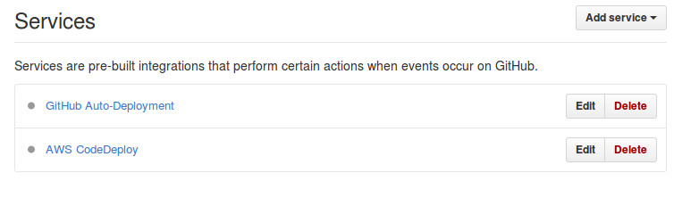
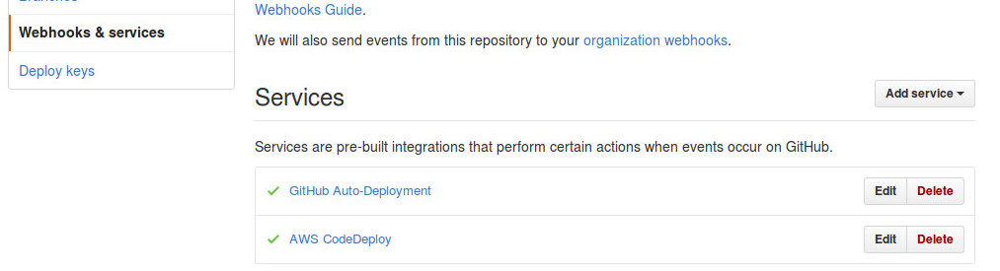

#Example of code delivery via AWS CodeDeploy

##Condition

We have some scripts in [scripts](scripts) directory. We have to deliver them into some ec2 server and deploy them as required

##Settings

###Terraform

[codedeploy_deployment_group](https://www.terraform.io/docs/providers/aws/r/codedeploy_deployment_group.html)

###CodeDeploy

First deployment must by done in AWS console manually

All your deployment process have to be described into [appspec file](http://docs.aws.amazon.com/codedeploy/latest/userguide/how-to-add-appspec-file.html) which placed with your code

####Deploy revision

In the AWS CodeDeploy console of your application chose deployment group which you need and in actions list chose "Deploy new revision"

####Triggers

You can use triggers for notification via SNS

####For private github repos

Use "Reconnect to GitHub" on "Create New Deployment" page and you have to add in github repo settings (Webhooks & services) service "AWS CodeDeploy"

Create a token in your account settings in "Personal access tokens". Add service "GitHub Auto-Deployment" in github repo settings (Webhooks & services)

After creation this GitHub services their states will be off

but after first commit they should be activated

####Deploy previous revision

If you need to deploy previous revision (for example during instance bootstrap) when you have previous successful deployment you can use [custom ruby script](files/deploy_previous_revision.rb)

